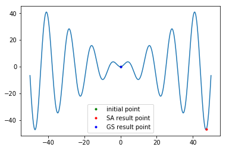
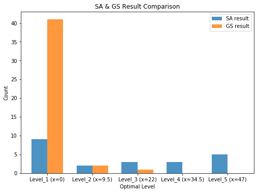

## Report

### Problem 1: Graph 2 Coloring

#### (a) 

I've implemented Metropolis SA algorithm in 2-coloring. The graph is specially generated as a uni-connected graph( A-B-C-D...) for scale-up convenience. Initial temperature $t_0$ is selected as 10, end by $t_{final}=0.1$ , deducts 0.05 at every step. 

| Graph_size | Error_mean | Error_std   |
| ---------- | ---------- | ----------- |
| 5          | 0.05       | 0.217944947 |
| 10         | 0.4        | 0.583095189 |
| 15         | 0.95       | 0.804673847 |
| 20         | 1.75       | 0.993730346 |
| 25         | 2.45       | 1.59608897  |
| 30         | 2.85       | 1.194780315 |
| 35         | 3.85       | 1.796524422 |
| 40         | 4.8        | 1.805547009 |
| 50         | 7.05       | 2.132486811 |

#### (b)

After generalized to multi-way choices, I tested 3-coloring with graph_size=50, this one-time error is 0.0, which is way lower than the 2-coloring error, the coloring ability has been greatly improved.

### Problem 2: Function Optimization

Then I've integrated the graph coloring and function optimization into 1 simulated_annealing function(dicern tasks by whether providing graph input). With default value set to $t_0=10$, $t_{final}=0.1$, N_T=5, N_c=2, T_step=0.05, x update initial step=0.9, $x_{initial}=0.0$. 

For test function, I chose $$x sin(x/2)$$ in range of [-50, 50]  where contains 9 local optima and 2 of them are the best result. 

To feel this directly from aboving plot, it's obvious that SA can reach a more global optimum than coordinate descent.

More quatitatively, I evaluate the results by following aspects:

1. Counting: Number points that belong to different optimal levels, if x is in [optimum_x +- gap]
2. Average Weighted Error: Assign different weights to different optimal range, sum up and average to get a error measure.

SA average error to the nearest optimum point: 3.1393 

GS average error to the nearest optimum point: 0.0459

For GS, results are more concentrated around the worst optimal point x=0, but errors to this point is relatively small.
SA can get to higher level optima easily, but the precision is relatively low.