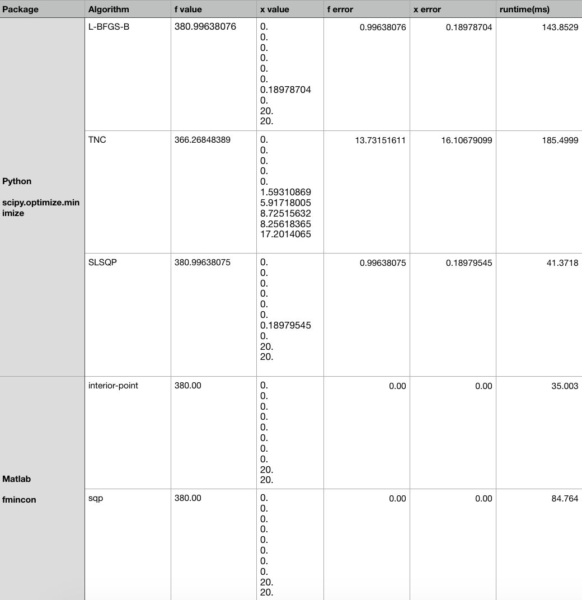
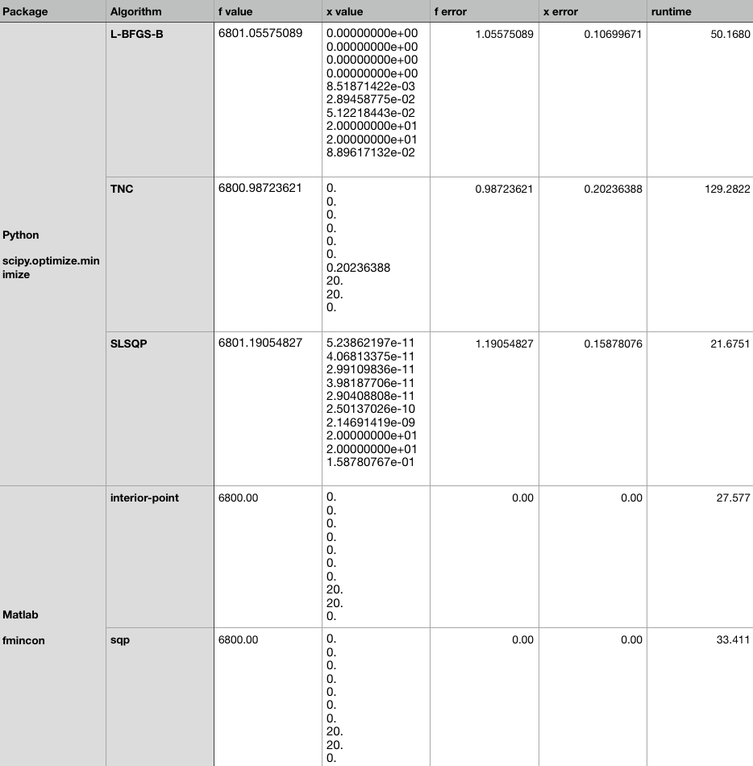

## Optimization Homework #4 

## 1.Linear

### Problem settings

Little Bill has a sweet-tooth, he decided to spend all his pocket money on candies in a candy store:

1. He ranked his top 10 favorite candies and want to have the maximum pleasure.

   Maximize $f(\bold{x}) = x_0+2x_1+3x_2+4x_3+5x_4+6x_5+7x_6+8x_7+9x_8+10x_9$

   If we write in matrix form:

   Maximize $f(\bold{x}) = \bold{A}\bold{x}^T$

   $\bold{A} = [1,2,3,4,5,6,7,8,9,10]$ , $\bold{x}=[\bold{x_i}], i=0,1,2...9 $

   $\bold{x_i}$ is how many pounds i-th ranked candies Bill should buy.

   And we can convert the maximum problem into minimize problem by defining $f(\bold{x}) = -\bold{A}\bold{x}^T$

2. However, he has limited pocket money. The prices of his favorite candies per pound is listed as $\bold{P} = [3,3,3,4,4,4,4,5,5,5]$, the constraint is $\bold{P}\bold{x}^T\le200$.

3. For every kind of candies, the store can only sell limited amount to one customer, and the amount can't be negative as we all know, thus $0\le\bold{x}_i\le20$.

To sum up, the abstract optimization problem is as follows:

Minimize $$f(\bold{x}) = -\bold{A}\bold{x}^T$$, with  $\bold{A} = [1,2,3,4,5,6,7,8,9,10]$ , $\bold{x}=[\bold{x_i}], i=0,1,2...9 $

Subject to: 

1. $$\bold{P}\bold{x}^T\le200$$ with $\bold{P} = [3,3,3,4,4,4,4,5,5,5]$ , $\bold{x}=[\bold{x_i}], i=0,1,2,...,9 $
2. $0\le\bold{x}_i\le20, i=0,1,2,...,9$

For the assignment criterion: 

1. Here we have 10 variables; 
2. The objective function is non-trivial as it contains all variables; 
3. There are 11 contraints in total, the price constraint is an inequality contriant including all variables.

### Compare LP solving algorithms

**Derive the penalty function for implicit constraint term**:

We want 

1. $$\phi(t), t=g(x)$$ to be continuous; 
2. $$\phi(t)\ge0, \forall t$$; 
3. $$\phi(t)=0$$ for $t\le0$ and $\phi$ is strictly increasing when $t>0$.

Thus we have $$\phi(\lambda, t) = \lambda t^n$$ while $t=g(x)>0$; $\phi(\lambda, t) =0$ while $g(x)\le0$. 

That means when the inequality constraint is statisfied: $g(x)\le0$, there's no penalty; once the constraint is voilated: $g(x)>0$, the function result should be $f(x)+\phi(g(x))$.

Therefore, we can rewrite our function as $$f(\bold{x}) = -\bold{A}\bold{x}^T+\lambda (\bold{P}\bold{x}^T-200) ^n$$ , here I choose $\lambda =1, n=4$. So the penalized function is $f_{p}(\bold{x})= -\bold{A}\bold{x}^T+ (\bold{P}\bold{x}^T-200) ^4$

**Algorithms**

I chose 3 algorithms from **Python scipy for penalized function with implicit constraint** and 2 algorithms from **Matlab fmincon with explicit constraint**.

For [**scipy**](https://docs.scipy.org/doc/scipy/reference/generated/scipy.optimize.minimize.html#scipy.optimize.minimize), I chose L-BFGS-B, TNC, SLSQP to optimize the penalized function, the bound constraints of each variables are specified as an input parameter, instead of being in the function.

For Matlab [**fmincon**](https://www.mathworks.com/help/optim/ug/fmincon.html#busp5fq-6), I chose interior point and sqp(sequential quadratic programming) algorithms. The bound and inequality constraints are all specified explicitly.

We all start from the same initial point $\bold{x}=[0,0,0,0,0,0,0,0,0,0]$. 

The **function value error** was evaluated absolute value, the **x error** is evaluated by norm of the difference between result vector and optimum vector.


### Comparison result



As we can see, the implicit constraint term added into the function is an approximation for the strict constraint. The smooth transition part around $g(x)\le0$ makes the optimum point drifting a little bit over the constraint, thus the result is also beyond the bound. Comparing to the explicit constraint used in Matlab, the result is strictly bounded.


## 2. Quadratic

### Problem setting

Bill accidentally found out that the 8-th and 9-th kind of candies can be ressolved into water, that will quadratically expand the amount. Thus his pleasure function becomes like:

$$f(\bold{x}) = x_0+2x_1+3x_2+4x_3+5x_4+6x_5+7x_6+8x_7^2+9x_8^2+10x_9$$

As the pleasure value of 8-th and 9-th candies are quadratically enhanced, the optimal choice would buy these two as much as possible with his pocket money.

Leave all other setting unchanged except the initial point $\bold{x}_0=[1,1,1,1,1,1,1,1,1,1]$

### Comparison result



The performances are almost the same as the linear conditions, the implicit constrained function has a loose bound thus the optimum value always not that exact. The explicit constrained ones has perfectly solved this problem.


### Appendix

Linear Python:

```python
from scipy.optimize import minimize, LinearConstraint
import numpy as np
import time

cons = [{"type": "ineq", "fun": lambda x: A @ x.T }]

init_x = np.matrix([0,0,0,0,0,0,0,0,0,0])
# func = lambda x: x[0] + 2*x[1] + 3*x[2] + 4*x[3] + 5*x[4] + 6*x[5] + 7*x[6] + 8*x[7] + 9*x[8] + 10*x[9]

def penalized_func(x,c=1,n=4, price_bound=200):
    A = np.matrix([1,2,3,4,5,6,7,8,9,10])
    prices = np.matrix([3,3,3,4,4,4,4,5,5,5])
    fx = -A@(x.T)
    
    # Price constraint
    if(prices@x.T > price_bound):
        return fx + c*(prices@x.T-price_bound)**4
    
    # Bound constraint
#     for i in range(10):
#         if(x.item(i)>20 or x.item(i)<0): 
#             return 1e10

    return -A@(x.T)


bnds = ((0,20), (0,20), (0,20), (0,20), (0,20), (0,20), (0,20), (0,20), (0,20), (0,20))

# Algo with Bound constraints: L-BFGS-B, TNC, SLSQP and trust-constr methods
methods = ['L-BFGS-B','TNC','SLSQP']

x_opt = [0,0,0,0,0,0,0,0,20,20]
f_opt = 380

for m in methods:
    print("\n%s:" %m)
    start = time.time()
    
    ans = minimize(penalized_func,init_x, method=m, bounds=bnds)
    end = time.time()

    runtime = (end-start)*1000

    f_res = -ans.fun
    x_res = np.array(ans['x'])
    
    x_error = np.linalg.norm(x_opt - x_res)
    f_error = abs(f_res - f_opt)

    print("Function value: {}\nf error: {}\nx value: {}\nx error: {}\nruntime: {} ms".format(f_res, f_error, x_res, x_error, runtime))
```

Quadratic Python:

```python
cons = [{"type": "ineq", "fun": lambda x: A @ x.T }]

init_x = np.matrix([1,1,1,1,1,1,1,1,1,1])
# func = lambda x: x[0] + 2*x[1] + 3*x[2] + 4*x[3] + 5*x[4] + 6*x[5] + 7*x[6] + 8*x[7] + 9*x[8] + 10*x[9]

def penalized_quadfunc(x,c=1,n=4, price_bound=200):
    A = np.matrix([1,2,3,4,5,6,7,8,9,10])
    prices = np.matrix([3,3,3,4,4,4,4,5,5,5])
    fx = x[0] + 2*x[1] + 3*x[2] + 4*x[3] + 5*x[4] + 6*x[5] + 7*x[6] + 8*x[7]**2 + 9*x[8]**2 + 10*x[9]
    
    # Price constraint
    if(prices@x.T > price_bound):
        return -fx + c*(prices@x.T-price_bound)**4

    return -fx


bnds = ((0,20), (0,20), (0,20), (0,20), (0,20), (0,20), (0,20), (0,20), (0,20), (0,20))

# Algo with Bound constraints: L-BFGS-B, TNC, SLSQP and trust-constr methods
methods = ['L-BFGS-B','TNC','SLSQP']

x_opt = [0,0,0,0,0,0,0,20,20,0]
f_opt = 6800

for m in methods:
    print("\n%s:" %m)
    start = time.time()
    
    ans = minimize(penalized_quadfunc, init_x, method=m, bounds=bnds)
    end = time.time()

    runtime = (end-start)*1000

    f_res = -ans.fun
    x_res = np.array(ans['x'])
    
    x_error = np.linalg.norm(x_opt - x_res)
    f_error = abs(f_res - f_opt)

    print("Function value: {}\nf error: {}\nx value: {}\nx error: {}\nruntime: {} ms".format(f_res, f_error, x_res, x_error, runtime))
```

Matlab

```matlab
% x0 = [0,0,0,0,0,0,0,0,0,0];
x0 = zeros(1,10);
x1 = ones(1,10);

% Favorite rank
fun = @(x)(-x(1) - 2*x(2) - 3*x(3) - 4*x(4) - 5*x(5) - 6*x(6) - 7*x(7) - 8*x(8) - 9*x(9) - 10*x(10));
% pen_fun = @(x)(-x(1) - 2*x(2) - 3*x(3) - 4*x(4) - 5*x(5) - 6*x(6) - 7*x(7) - 8*x(8) - 9*x(9) - 10*x(10)...
%     -(3*x(1) + 3*x(2) + 3*x(3) + 4*x(4) + 4*x(5) + 4*x(6) + 4*x(7) + 5*x(8) + 5*x(9) + 5*x(10))^4);
quad_fun = @(x)(-x(1) - 2*x(2) - 3*x(3) - 4*x(4) - 5*x(5) - 6*x(6) - 7*x(7) - 8*x(8)^2 - 9*x(9)^2 - 10*x(10));
% quad_fun1 = @(x)(-(x(1) + 2*x(2) + 3*x(3) + 4*x(4) + 5*x(5) + 6*x(6) + 7*x(7) + 8*x(8) + 9*x(9) + 100*x(10)^2));

% Prices
A = [3,3,3,4,4,4,4,5,5,5];

% Money Limit
b = 200;

lb = zeros(1,10);
ub = 20*ones(1,10);

%'interior-point' (default); 'trust-region-reflective'; 'sqp';'sqp-legacy' (optimoptions only);'active-set'

options.Algorithm = 'sqp';
tic
[x,fval] = fmincon(quad_fun, x1, A, b, [], [], lb, ub,[], options);
toc
disp(x)
disp(-fval)


```

