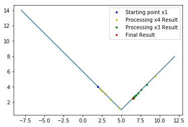

# 1D Unconstrained Minimization

一维无限制最小化也被称为线性优化，通常根据算法适用的最优点类型划分为单点最优算法和多点最优算法。  

These kind of optimizations are also called **line minimization algorithms**, traditionally, it can be categorized into methods that find local minima & global minima.   

局部最优的方法主要有 Fibonacci Algorithm 和 Golden Section Algorithm，本文将会深入阐述。另外还有一种基于多项式近似的 Brent's Method，基于二次近似甚至三次近似来做区间更新和缩减。

For unimodal minimization algorithms to find local minimization, there are two foundamental methods named **Fibonacci Algorithm** and **Golden Section Algorithm** that we will get into details, there's also a **Brent's Method**, which updates every step based on polynominal quadratic or even cubic.  

全局最优方法主要有 Shubert-Piyavskii，通过一个预先确定的区间更新方法，不断更新区间内的最优锯齿点来实现保证找到全局最优。(模拟退火和基因算法找全局最优是基于随机搜索)

When comes to multimodal methods, there's a **Shubert-Piyavskii** method to find the global minimum in a deterministic search, keep updating the saw-tooth points to make sure finding the global optimum. (While simulated annealing or genetic algorithm is based on random search)

## Unimodal minimization algorithms

All these three methods covered here are based on a simple thought: Bracketing / Three-Point Pattern.

找局部最优传统方法的核心思想就在于：对于每一步，根据当前点找到一些参考点从而确定一个函数值在减小的区间，不断重复直到满足条件。

The intrinsic ideas behind all these three methods are : **For every step, given an initial point, we set an interval and sample some inner points to locate the minima; then iterate to shrink the interval util we reach the minima.** The difference between following methods lies in how we update every intervals.  

Let's take a look at Fibonacci first.

###Fibonacci Algorithm

[Fibonacci numbers](https://en.wikipedia.org/wiki/Fibonacci_number) are developed by Leonardo of Pisa(nicknamed Fibonacci) in the study of reproduction of rabbits.

Fibonacci method is the best when we know which interval is the optimum in, i.e. if we know the range that contains the optimum point, Fibonacci can lead us to the value with the least efforts(in the least number of trials or function evaluations).

By proceeding in the reverse order of Fibonacci numbers, intervals are updated as listed below:

$I_1 = F_nI_n $, $I_2=F_{n-1}I_n$

 $I_2 = \frac{F_{n-1}}{F_n}I_1$

And we have the Binet's formula to get every Fibonacci numbers.

Binet's formula: $F_i = \frac{1}{\sqrt5}\left[ (\frac{1+\sqrt5}{2})^{i+1}-\frac{1-\sqrt5}{2})^{i+1}\right]$

$\alpha = \frac{F_{i-1}}{F_i}=(\frac{\sqrt5-1}{2})(\frac{1-s^i}{1-s^{i+1}}) \ \ i=2,3,...n \ \ s=\frac{1-\sqrt5}{1+\sqrt5}$

Step update: $x_3 = \alpha x_4 + (1-\alpha)x_1$, $x_2 = \alpha x_1 + (1-\alpha)x_4$

Stop criterion: set desired accuracy $\epsilon=\frac{I_n}{I_1}$, find smallest n such that $\frac{1}{F_n} < \epsilon$

As the number of iterations is increased, the ratio $\frac{F_{n-1}}{F_n}$ reaches the limit $\frac{\sqrt5-1}{2}=0.61803$, when the number of iterations get larger than 12, the ratio is within $\pm0.0014\%$ of the limit $\frac{\sqrt5-1}{2}$ , which is called the golden ratio. Then it comes to another method that its interval reduction strategy is the golden ratio.

### Golden Section

Given a intial start point, the intervals are determined as follows:

$I_n = \tau^{n-1}I_1$

$\frac{I_n}{I_{n-1}} = \tau = \frac{\sqrt5-1}{2} = 0.61803$

 Three-point pattern: $x_2 = x_1+ s$, then make sure $x_2<x_1$; $x_4 = x_1 + (1+\frac{1}{\tau})s$ ; then make sure $f_4 > f_2$ ; $s=\frac{s}{\tau}$ ; 

Stopping Criteria:

1. Absolute + Relative

Absolute part: Tolerance values $\epsilon_x$ for interval value; $\epsilon_F$ for function value 

Relative part: Based on machine precision $\epsilon_R$ & current best point $x_2$ ; $\epsilon_R = \sqrt{\epsilon_{machine}}$

Interval check: $|x_1-x_4| \le \epsilon_R|x_2| + \epsilon_x$

Funcion value check: $\bar f = \frac{f_1+f_2+f_3}{3}$

$\bar{f}-\bar{f}_{old}\le \epsilon_R|f_2| + \epsilon_F$

2. Based on total number of function evaluations N
3. Based on x-value: $xtol = \sqrt{\epsilon_m}(1.+abs(x_2))$, stop when $x_3-x_1\le2xtol$
4. Based on f-value: $ftol=\sqrt{\epsilon_m}(1.+abs(f_2))$ ,stop when $\bar f_{new}-\bar f_{old} \le ftol$

### Coordinate Descent

Coordinate descent is simply a expansion into multi-dimensional line minimization methods, optimize one dimention at a time.

### Golden Section & Coordinate Descent Implementation and Analysis:

[Github jupyter notebook Link](https://github.com/MarvinLSJ/CS268_Optimization/blob/master/hw1/hw1.ipynb) : It contains the detailed implementation of **Golden Section Method** and **Coordinate Descent** in python, and several test functions as well as the performance analysis.

The parameters and implementation details are omitted here, but you can find them thoroughly explained in the link above, here are some simple illustrations:

Another test:

[Bessel's correction](https://en.wikipedia.org/wiki/Bessel%27s_correction): Multiplying the uncorrected sample variance by the factor $\frac{1}{n-1}$, $s^2=\frac{n}{n-1}s_n^2$

### Polynomial-Based Methods

As interval becomes small, a smooth function can be approxiamated by a polynomial. The minimum point of the polynomial fit is a good candidate for the minimum value of the function.  

Quadratic fit of [Lagrange polynomial](https://en.wikipedia.org/wiki/Lagrange_polynomial): 

$$q(x)=f_1\frac{(x-x_2)(x-x_3)}{(x_1-x_2)(x_1-x_3)} + f_2\frac{(x-x_1)(x-x_3)}{(x_2-x_1)(x_2-x_3)}+f_3\frac{(x-x_1)(x-x_2)}{(x_3-x_1)(x_3-x_2)}$$

## Multimodal Minimization Algorithm

### Shubert-Piyavskii Method

This method is designed to find the global maximum. It has first assumed the function is [Lipschitz continuous](https://en.wikipedia.org/wiki/Lipschitz_continuity), that is, for function $f(x)$ in $[a,b]$, there is a constant L > 0 that 

$$|f(x)-f(y)|\le L|x-y|, \forall x,y\in[a,b]$$

A sequence of points converging to the global maximum is genreated by constructing a saw-tooth cover over the function.

1. Given function $f(x_n)$, interval $[a,b]$ and starting point $x_0$.
2. Select sampling point $x_0$ at the midpoint of the interval, then draw a pair of lines by $f(x) = f(x_0) + L|x-x_0|$
3. Find the two saw-tooth points $\{(t_1,z_1),(t_2,z_2)\}=\{(b,f(x_0+\frac{L}{2}(b-a), (a,f(x_0)+\frac{L}{2}(b-a)\}$
4. Add saw-tooth points into a set arranged as $z_1\le z_2 \le ...\le z_n$, and replaces the last point with the saw-tooth point drawn from $f(t_n)$.
5. Stop when $z_n-y_n \le \epsilon$

