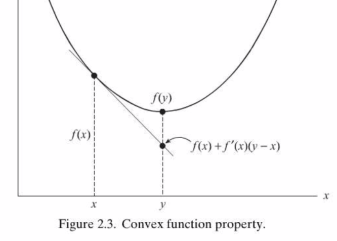

# 机器学习-如何在github上写数学公式

## Optimization Introduction

近几年优化方法因机器学习变得流行起来，从随机梯度下降，BFGS到adam，大多数机器学习问题能被抽象化为优化问题。所以想要真正理解机器学习算法，熟悉各类优化算法是如何找到最优解，以及面对各类优化问题我们应该如何选择是非常重要的。因此我将在UCI Optimization课程中所学到的东西记录下来，用于加深理论理解，同时也分享给同样感兴趣的人。
 

Optimization has been a hit recently because of the surge of machine learning and deep learning. From stochastic gradient, BFGS to adam, the genuie problem of most machine learning problem can be melt down to a optimization problem, it's essential for us to understand how do these methods lead us to the optimal, and which methods to choose when facing different kind of optimization problems. Therefore I took down what I've learnt from the optimization course to solidify my theorical foundation and gain a deeper understanding of what happend behind all these optimization process, as well as sharing and discussing with you.

### Historical Sketch
优化在研究和工业界中应用十分广泛；早在1960年非线性优化就被Schmit应用于结构设计，1961被Johnson应用于工程优化。如今应用从验证蛋白分子结构到追踪电磁波遍地开花，数十年来飞机机翼的大小都是通过优化方法决定。
 
Optimizations are wildly used in research and industrial; Nonlinear optimization methods were applied in structural design early back in 1960 by Schmit, engineering optimization in 1961 by Johnson. Today, applications are everywhere, from identifying structures of protein molecules to tracing electromagnetic rays, and optimization has been used for decades in sizing airplane wings.
 
Gradient-based Method

| When  | Who                  | What                                                         |
| ----- | -------------------- | ------------------------------------------------------------ |
| 1847  | Cauchy               | First gradient method                                        |
| 1943  | Courant              | Penalty                                                      |
| 1951  | Karush, Kuhn, Tucker | KKT optimality conditions for constrained problems           |
| 1964  | Fletcher and Reeves  | Conjugate gradient (unconstrained method)                    |
| 1971  | Brent and others     | hybrid polynomial-interval methods                           |
|       |                      | Interval search using Golden section & Fibonacci numbers     |
| 1970s |                      | Sequential quadratic programming(SQP) for constrained minimizations |
| 1984  | Karmarkar            | Interior methods for linear programming                      |

 

Non-gradient Method

| When | Who                     | What                  |
| ---- | ----------------------- | --------------------- |
| 1952 | Bellmen                 | Dynamic programming   |
| 1953 | Metropolis              | Simulated annealing   |
| 1960 | Rosenbrock              | Orthogonal directions |
| 1961 | Hooke and Jeeves        | Pattern search        |
| 1964 | Powell                  | Conjugate directions  |
| 1965 | Nelder and Meade        | Simplex method,       |
| 1967 | Duffin, Peterson, Zener | Geometric programming |
| 1975 | Holland                 | Genetic algorithms    |

 

### Optimization modeling

Most engineering problems can be expressed as minimizing (add a minus if maximizing), which has a general form:
 

minimize  $ f(x)$

subject to $g_i(x)\le0, i=1,...,m$

and $h_j(x) = 0, j=1,....,l$ 

and $x^L\le x\le x^U$

where $x= (x_1,x_2,....,x_n)^T$

 
### Example

**Shortest distance from a point to a line**
 
Given a line $$a_0+a_1x_1 + a_2x_2=0$ and a point  $x^0=(x_1^0, x_2^0)$$

minimize $$f=(x_1-x_1^2)^2 + (x_2-x_2^0)^2$$

subject to $$h(x) \equiv a_0+a_1x_1+a_2x_2=0$$

In matrix form:

minimize $$f=(\boldsymbol{x} - \boldsymbol{x}^0)^T(\boldsymbol{x} - \boldsymbol{x}^0) $$

subject to $$h(\boldsymbol{x}) \equiv \boldsymbol{a}^T \boldsymbol{x} - b  = 0$$

Using method of *Lagrange multipliers*, obtained $$\boldsymbol{x}^* = \boldsymbol{x}^0 - \frac{(\boldsymbol{a}^T\boldsymbol{x}^0-b)}{\boldsymbol{a}^T\boldsymbol{a}}\boldsymbol{a}$$

Thus the shortest distance *d* is $$d=\frac{|\boldsymbol{a}^T \boldsymbol{x}^0-b|}{\sqrt{(\boldsymbol{a}^T \boldsymbol{a})}}$$

This problem can be generalized to a point to any dimension hyperplane.

 

### Weierstrass Theorem

[Weierstrass theorem](https://en.wikipedia.org/wiki/Extreme_value_theorem) (Extrem value theorem) states that if a real-valued function  $f(x)$ is **continuous on the closed interval [a,b]**, then  $f(x)$ must attain a maximum and a minimum, each at least once.

i.e. There must exist real numbers *m* and *M* such that: $m<f(x)<M$, for all $x\in [a,b]$ 

 

### Quadratic Forms

Consider $f=x_1^2 - 6x_1x_2+9x_2^2$, we can rewrite it in **Quadratic Form**:   

$$f= (x_1\  x_2) \left[
\begin{matrix}
1 & -3  \\
-3 & 9  \\
\end{matrix}\right] \left(\begin{matrix}x_1 \\ x_2 \end{matrix}\right)$$ 

More simple as $f=\boldsymbol{x}^T \boldsymbol{A} \boldsymbol{x}  $, $\boldsymbol{x}$ is an n-vector, $\boldsymbol{A}$ is the coeffiecient matrix, and it's [symmetric](https://en.wikipedia.org/wiki/Symmetric_matrix), also can be expressed in index notation as $\sum_i\sum_jx_ia_{ij}x_j$.

 
### Positive Definite Matrices

What is **Positive Definite**?

A quadratic form is [positive definite](https://en.wikipedia.org/wiki/Positive-definite_matrix) if $\boldsymbol{y}^T \boldsymbol{A} \boldsymbol{y} >0$  for any nonzero vector $\boldsymbol{y}$ , and $\boldsymbol{y}^T \boldsymbol{A} \boldsymbol{y} >0$ if and only if $\boldsymbol{y}=0$ .All eigenvalues of a positive definite matrix are strictly positive.

$\boldsymbol{A}$ is negative definite if ($-\boldsymbol{A}$ ) is positive definite. 

A quadratic form is positive semidefinite if $\boldsymbol{y}^T \boldsymbol{A} \boldsymbol{y} \ge 0 $ for any nonzero  $\boldsymbol{y}$. All eigenvalues of a positive semidefinite matrix are nonnegative.
 
**Sylvester's test** for a positive definite matrix: Denote $\boldsymbol{A}^i$ the submatrix of up-left square matrix with $i$  length, $\boldsymbol{A}$ is positive definite if and only if det($\boldsymbol{A}^i$) > 0, for $i=1,2,...,n$.

 

### $\boldsymbol{C^n}$Continuity

We say the function $f$ is $C^0$ continuous at a point $\boldsymbol{a}$ if: given any sequence {$\boldsymbol{x}_k$} in $D(f)$ which converges to $\boldsymbol{a}$, then $f(\boldsymbol{x}_k)$ must converge to $ f(\boldsymbol{a})$.
 
$C^1$ and $C^2$ Continuity is considering the continuity of $d(f)$  and $d^2(f)$.

 

### Gradient Vector and Hessian Matrix

Given a function $f(x) \in C^1$, the **gradient vector** $\nabla f = [\frac{\partial f}{\partial x_1}, \frac{\partial f}{\partial x_2}, ..., \frac{\partial f}{\partial x_n}]^T$ 

Directional derivative of $f$  is the derivative of $f$ in any unit direction $\boldsymbol{s}$ at a point $\boldsymbol{c}$, obtained as: $$D_sf(\boldsymbol{c}) = lim_{t\to0}\frac{1}{t} \{f(\boldsymbol{c}+t\boldsymbol{s})-f(\boldsymbol{c})\} = \nabla f(\boldsymbol{c})^T\boldsymbol{s}$$

The **Hessian Matrix**
 
$$\nabla^2f \equiv \left[ \begin{matrix} \frac{\partial^2f}{\partial x_1 \partial x_1} & \frac{\partial^2f}{\partial x_1 \partial x_2} & ... & \frac{\partial^2f}{\partial x_1 \partial x_n}\\ \  & \frac{\partial^2f}{\partial x_2 \partial x_2} & ... & \frac{\partial^2f}{\partial x_2 \partial x_n}\\ &...\\ symmetric &  & &\frac{\partial^2f}{\partial x_n \partial x_n}\\ \end{matrix}\right] $$

The [Hessian](https://en.wikipedia.org/wiki/Hessian_matrix) is related to the convexity of the function, the Hessian of $f$ at a point $\boldsymbol{c}$ is denoted as $\nabla^2f(\boldsymbol{c})$.

### Newton's forward difference formula
Newton's forward difference formula is a numerical evaluation of gradient.

**Newton's forward difference formula** is often utilized to obtain an approximate expression for $\nabla f$ at a given point. The general formula is $$\frac{\partial f}{\partial x_i} \approx \frac{f(x_1^0 , x_2^0 ... x_i^0 + \epsilon ... x_n^0) - f(\boldsymbol{x}^0)}{\epsilon}, i=1,...n$$

For greater accuracy, the central difference formula choose the different value between $x_i^0-0.5\epsilon$ and $x_i^0+0.5\epsilon$.
 
### Taylor's Theorem & Quadratic Approximation

1-Dimension: $$q(x) = f(x_0) + f^\prime(x_0)(x-x_0) + \frac{1}{2}f^{\prime\prime}(x_0)(x-x_0)^2$$

n-Dimension: $$f(\boldsymbol{x}) = f(\boldsymbol{x}^0) + \nabla f(\boldsymbol{x}^0)^T(\boldsymbol{x}- \boldsymbol{x}^0) + \frac{1}{2}(\boldsymbol{x}-\boldsymbol{x}^0)^T\[\nabla^2f(\boldsymbol{z})\](\boldsymbol{x}-\boldsymbol{x}^0)$$

 

### Linearly Independence
**Linearly Independence of Vectors**:  $\boldsymbol{x}_3$ can not be formed by $\boldsymbol{x}_1$ and $\boldsymbol{x}_2$, then $\boldsymbol{x}_3$ is independent of $\boldsymbol{x}_1$ and $\boldsymbol{x}_2$.

Definition: If linear combination $\sum_{k=1}^m\alpha_k\boldsymbol{x}^k=0$ implies that all $\alpha_k$ are zero.

 

### Convexity 

**Convex set**: If for any two points in the set, every point on the line joining the two points is in the set. 

 $\forall x_1, x_2, 0\leq \alpha \leq1$, the point $\alpha x_1 + (1-\alpha)x_2$ is in the set.

**Convex domain**: For domain $\Omega$, $ 0\leq \lambda \leq1, \forall \boldsymbol{x},\boldsymbol{y} \in \Omega, \ \ (1-\lambda)\boldsymbol{x} + \lambda\boldsymbol{y} \in \Omega$

**Convex function**: $\forall \boldsymbol{x}_1. \boldsymbol{x}_2 \in R^d, 0\leq \lambda \leq1$

$$f(\lambda \boldsymbol{x}_1 + (1-\lambda)\boldsymbol{x}_2)\leq \lambda f(\boldsymbol{x}_1) + (1-\lambda) f(\boldsymbol{x}_2)$$

Properties of convex function:

1. $f^{\prime \prime}(x) \ge 0​$ in $\Omega​$

2. $f\subset C^1$, $f$ is convex over $\Omega$ if and only if $\forall x,y \ f(y) \geq f(x) + f^\prime(x)(y-x)$

   

3. $f\subset C^1$, $f^\prime(x^\star)(y-x^\star)\ge0$ for every y in S, then $x^\star$ is the global minimum

4.  $f\subset C^2$,  $f$ is convex over $\Omega$ <--> $f(y) \geq f(x) + \nabla f(x)^T(y-x), \forall x,y \in \Omega$  

5. $f$ is convex  and $x^\star$ is the global minimum if $\nabla f(x^\star) = 0$ (Can be proved by #2) 

