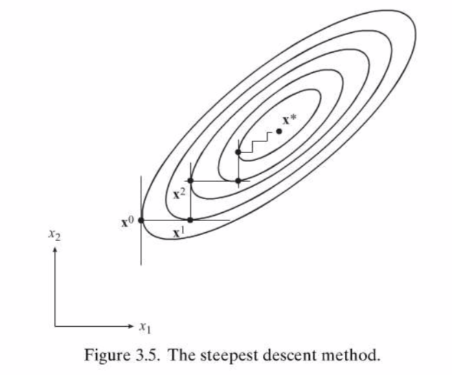

# Steepest Descent

Let's consider this classical numerical methods for unconstrained minimization of a function of n variables.

## Ironhead's treasure trip

To make it simple and fascinating, let's consider optimizing a function like finding the mysterious treasure in a barbarian way: 

Let me introduce Ironhead, the barbarian hero who wants to gain his glory by finding the treasure ahead of others. He got the fancy skill named "furious charge", he can dash furiously towards one direction as far as he want ignoring any obstacles, but that skill cools down everyday, which means he could only charge towards one direction as far as he want everyday. However, that won't seperate him with other barbarians, so we help him by giving him a treasure-detection device: it tells him the distance between his location and the treasure spot. And Ironhead is smart enough to figure out that he can step out a little bit to see which direction makes distance decreasing the most, e.g. he can find out the best direction for his current location everyday.   

Then he start his trip, good luck and bon voyage, Ironhead!

##

## Calm down and analyze

While he's charging furiously, let's re-think this in a magician(or probably college students') way:

Ironhead got two blessing gifts corresponding to the exact two words in steepest descent, the device tells him current best "descent" direction, and the furious charge allows him explore "steepest" to get to the best position along this direction. More mathmatically, Ironhead is trying to minimize the distance between him and the treasure, the device could provide him the evaluation function $f(x)$ as well as the first order derivative $df(x)$; If we only consider the result, his furious charge is similar to the [line minimization method](https://marvinlsj.github.io/2018/11/04/1D%20Unconstrained%20Minimization/) introduced last time.

Let $\bold{x_k}$ be Ironhead's location on the k-th day and $\bold{x_k}+\alpha \bold{d}$ is his location by the end of the day.

$\bold{d}$ is the best descending direction he figured out by stepping out a little bit while watching the distance device, which is exactly the reverse of the derivative: $-\nabla f(\bold{x_k})$. Every morning he wake up and decide the direction $\bold{d_k}$ by his current location $\bold{x_k}$ and the help of the device $\nabla f(\bold{x_k})$.

$\alpha$ is how far he traveled that day, he'll stop at the minimum point along current direction. As long as he decided today's direction $\bold{d_k}$, we can define $f(\alpha) = f(\bold{x_k}+\alpha\bold{d_k})$, which is the function he would like to minimize today, theoretical we can derive $f(\alpha)$ to find best $\alpha$ by $\nabla f(\alpha) = 0$, but don't forget it's Ironhead here, he's better at "dash and bump into treasure" kind of thing. (Actually, it's because we can't ensure the function $f(\alpha)$ is derivative everywhere and it's burdensome and hard to derive a function for every interation in implementation).

After aboving analysis, we can be sure that he will eventually get to the treasure, but it seems he haven't found the treasure yet, let's take a look at the algorithm.

## Steepest Descent Algorithm

### Direction Vector

For every step, $\bold{x_k}$ is the current point at k-th interation, $\bold{x_k}+\alpha\bold{d_k}$ is the next point. We want $f(\bold{x_k}+\alpha\bold{d_k})\lt f(\bold{x_k})$, expand $f(\bold{x_k}+\alpha\bold{d_k})$ using Taylor's expansion:

 $$f(\bold{x_k}+\alpha\bold{d_k}) = f(\bold{x_k})+ \alpha \nabla f(\bold{x_k})^T\bold{d} + \bold{O}(\alpha^2)$$ 

Thus, 

$$f(\bold{x_k}+\alpha\bold{d_k}) - f(\bold{x_k}) = \delta f(x)= \alpha \nabla f(\bold{x_k})^T\bold{d} + \bold{O}(\alpha^2)$$

For small enough $\alpha$ the term $O(\alpha^2)$ is dominated, we want $\delta f \lt 0$, that is 

$$\nabla f(\bold{x_k})^T\bold{d}\lt0$$

The steepest descent chooses $$\bold{d_k} = -\nabla f(\bold{x_k})$$, so that $\nabla f(\bold{x_k})^T\bold{d}=-||\nabla f(\bold{x_k})||^2\lt0$

### Algorithm steps

1. Input the start point $\bold{x_0}$, function $f(\bold{x})$ and $\nabla f(\bold{x})$ 
2. Start iteration(3-5) until the stopping criterion satistied, $k=0$
3. $\bold{d_k}=-\nabla f(\bold{x_k})$ and define $f(\alpha) = f(\bold{x_k}+\alpha\bold{d_k})$ 
4. Using line search to solve $\alpha_k = argmin_a(f(\bold{x_k}+\alpha\bold{d_k}))$
5. Update $\bold{x_{k+1}= \bold{x_k}+\alpha_k\bold{d_k}}$, set $\bold{x_k}=\bold{x_{k+1}}, k=k+1$

**Stopping criterion**:

1. Set $\epsilon_G$ to be the gradient tolerance, check $||\nabla f(\bold{x_k}||\le\epsilon_G$ 

2. It's similar to the "Absolute + Relative" criterion, check successive reduction: $$|f(\bold{x_{k+1}})-f(\bold{x_k})|\le \epsilon_{abs} + \epsilon|f(\bold{x_k})|$$

 ### Convergence characteristics

In step 4, we have $\frac{d(f(\bold{x_k}+\alpha\bold{d_k}))}{d\alpha}=0$, thus get $\nabla f(\bold{x_k}+ \alpha_k\bold{d_k}^T)\bold{d_k}=0$ or $\nabla f(\bold{x_{k+1}})^T\bold{d_k}=0$, since $\bold{d_{k+1}}=-\nabla f(\bold{x_{k+1}})$, we have $\bold{d_{k+1}}^T\bold{d_k}=0$. Therefore, each step is orthogonal to previous step.

It has been proven that the speed of convergence is related to the **spectral condition number of the Hessian matrix** $\kappa$. The spectral condition number $\kappa$ of a symmetric positive definite matrx is defined as 

$$\kappa = \frac{\lambda_{max}}{\lambda_{min}}$$ 

For well-conditioned Hessian matrices, the condition number is close to unity, contours are more circular; Higher the condition number, more ill-conditioned is the Hessian, the contours are more elliptical, thus there will need more zigzag to reach the optimum.

There are two main aspects regarding convergence:

1. The steepest descent is convergent from any starting point under mild conditions.
2. The method has a linear rate of convergence. Specifically, if the Hessian at the optimum is positive definite with spectral condition number $\kappa$, the sequence of function values at each iteration satisfy $$f_{k+1}-f^\star = \frac{(\kappa-1)^2}{(\kappa+1)^2}[f_k-f^\star]$$

### Implementation

[Steepest descent](https://github.com/MarvinLSJ/CS268_Optimization/blob/master/hw2/hw2.ipynb) is implemented and experimented in python on my github.

## The treasure

Finally, Ironhead has found the treasure chest, let's see what's inside!

Emmm... I guess we'll see Conjugate Gradient next time!